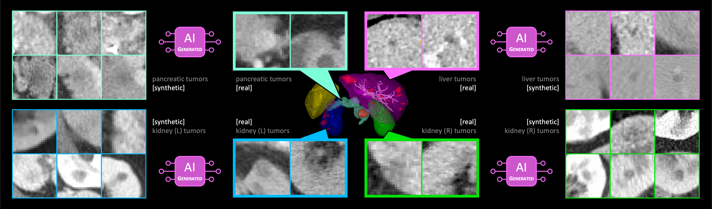

<h1 align="center">DiffTumor</h1>

<div align="center">


[](https://github.com/MrGiovanni/DiffTumor/stargazers)
<a href="https://twitter.com/bodymaps317">
        
</a><br/>
**Subscribe us: https://groups.google.com/u/2/g/bodymaps**  

</div>

We have shown that many types of tumors in different abdominal organs look very similar if they are small (less than 2cm) which implies that we can train the AI to detect tumors in the liver or kidney but only training the diffusion model on tumors in the pancreas ([Q. Chen et al. CVPR 2024](https://www.cs.jhu.edu/~alanlab/Pubs24/chen2024towards.pdf)). These studies have been validated both by studies of radiologists (by challenging them to distinguish between a synthetic tumor and a real tumor) and by comprehensive tests of the AI algorithms trained using stimulated data.

<p align="center"></p>

## Paper

<b>Towards Generalizable Tumor Synthesis</b> <br/>
[Qi Chen](https://scholar.google.com/citations?user=4Q5gs2MAAAAJ&hl=en)<sup>1</sup>, [Xiaoxi Chen](https://www.linkedin.com/in/xiaoxichensjtu/?originalSubdomain=cn)<sup>2</sup>, [Haorui Song](https://www.linkedin.com/in/haorui-song)<sup>3</sup>, [Zhiwei Xiong](http://staff.ustc.edu.cn/~zwxiong/)<sup>1</sup>, [Alan L. Yuille](https://www.cs.jhu.edu/~ayuille/)<sup>3</sup>, [Wei Chen](https://weichen582.github.io/)<sup>3</sup> and [Zongwei Zhou](https://www.zongweiz.com/)<sup>3,*</sup> <br/>
<sup>1 </sup>University of Science and Technology of China,  <br/>
<sup>2 </sup>Shanghai Jiao Tong University,  <br/>
<sup>3 </sup>Johns Hopkins University  <br/>
CVPR, 2024 <br/>
[paper](https://www.cs.jhu.edu/~alanlab/Pubs24/chen2024towards.pdf) | [code](https://github.com/MrGiovanni/DiffTumor) | [slides](https://github.com/MrGiovanni/DiffTumor/blob/main/documents/cvpr_slides.pdf) |  [huggingface](https://huggingface.co/MrGiovanni/DiffTumor)

**We have documented common questions for the paper in [Frequently Asked Questions (FAQ)](documents/FAQ.md).**

**We have summarized publications related to tumor synthesis in [Awesome Synthetic Tumors](https://github.com/MrGiovanni/SyntheticTumors/blob/main/AWESOME.md) [](https://awesome.re).**

**We have released videos for [Visual Turing Test](https://www.dropbox.com/scl/fo/mgw953fdysvto2y6bog1c/h?rlkey=pqe9ar4xzo52ggm5v8v43275v&dl=0).** Check to see if you could tell which is real tumor and which is synthetic tumor. 


## 0. Installation

```bash
git clone https://github.com/MrGiovanni/DiffTumor.git
cd DiffTumor
```

See [installation instructions](documents/INSTALL.md) to create an environment and obtain requirements.

## 1. Train Autoencoder Model
You can train Autoencoder Model on AbdomenAtlas 1.0 dataset by your own. The release of AbdomenAtlas 1.0 can be found at [https://huggingface.co/datasets/AbdomenAtlas/AbdomenAtlas_1.0_Mini](https://huggingface.co/datasets/AbdomenAtlas/AbdomenAtlas_1.0_Mini).
```bash
cd STEP1.AutoencoderModel
datapath=<your-datapath> (e.g., /data/bdomenAtlasMini1.0/)
gpu_num=1
cache_rate=0.05
batch_size=4
dataset_list="AbdomenAtlas1.0Mini"
python train.py dataset.data_root_path=$datapath dataset.dataset_list=$dataset_list dataset.cache_rate=$cache_rate dataset.batch_size=$batch_size model.gpus=$gpu_num
```
We offer the pre-trained checkpoint of Autoencoder Model, which was trained on AbdomenAtlas 1.1 dataset (see details in [SuPreM](https://github.com/MrGiovanni/SuPreM)). This checkpoint can be directly used for STEP2 if you do not want to re-train the Autoencoder Model. Simply download it to `STEP2.DiffusionModel/pretrained_models/AutoencoderModel.ckpt`
```bash
cd STEP2.DiffusionModel/pretrained_models/
wget https://huggingface.co/MrGiovanni/DiffTumor/resolve/main/AutoencoderModel/AutoencoderModel.ckpt
```


## 2. Train Diffusion Model
In our study, Diffusion Model focuses on the tumor region generation (simple texture and small shape). Early-stage tumors appear similar in the three abdominal organs, enabling models to effectively learn these characteristics from minimal examples. If you want to train Diffusion Model that synthesize early tumors, you need to first process the data to filter out the early tumors labels. We take the example of training Diffusion Model for early-stage liver tumors. 

Download the public dataset MSD-Liver (More datasets can be seen in [installation instructions](documents/INSTALL.md)). 
```bash
wget https://huggingface.co/MrGiovanni/DiffTumor/resolve/main/Task03_Liver.tar.gz
tar -zxvf Task03_Liver.tar.gz
```
We offer the preprocessed labels for early-stage tumors and mid-/late- stage tumors.
```bash
wget https://huggingface.co/MrGiovanni/DiffTumor/resolve/main/preprocessed_labels.tar.gz
tar -zxvf preprocessed_labels.tar.gz
```
<details>
<summary style="margin-left: 25px;">Preprocess details</summary>
<div style="margin-left: 25px;">

1. Download the dataset according to the [installation instructions](documents/INSTALL.md).  
2. Modify `data_dir` and `tumor_save_dir` in [data_transfer.py](https://github.com/MrGiovanni/DiffTumor/blob/main/data_transfer.py).
3. `python -W ignore data_transfer.py`
</div>
</details>
Start training.

```bash
cd STEP2.DiffusionModel/
vqgan_ckpt=<pretrained-AutoencoderModel> (e.g., /pretrained_models/AutoencoderModel.ckpt)
fold=0
datapath=<your-datapath> (e.g., /data/10_Decathlon/Task03_Liver/)
tumorlabel=<your-labelpath> (e.g., /data/preprocessed_labels/)
python train.py dataset.name=liver_tumor_train dataset.fold=$fold dataset.data_root_path=$datapath dataset.label_root_path=$tumorlabel dataset.dataset_list=['liver_tumor_data_early_fold'] dataset.uniform_sample=False model.results_folder_postfix="liver_early_tumor_fold"$fold""  model.vqgan_ckpt=$vqgan_ckpt
```

We offer the pre-trained checkpoints of Diffusion Model, which were trained for early-stage and mid-/late- stage tumors for liver, pancreas and kidney, respectively. This checkpoint can be directly used for STEP3 if you do not want to re-train the Diffusion Model. Simply download it to `STEP3.SegmentationModel/TumorGeneration/model_weight`

<details>
<summary style="margin-left: 25px;">Checkpoints</summary>
<div style="margin-left: 25px;">

| Tumor | Type | Download |
| ----  | ----  | ----     |
| liver  | early | [link](https://huggingface.co/MrGiovanni/DiffTumor/resolve/main/DiffusionModel/liver_early.pt) |
| liver  | mid&late | [link](https://huggingface.co/MrGiovanni/DiffTumor/resolve/main/DiffusionModel/liver_noearly.pt) |
| pancreas  | early | [link](https://huggingface.co/MrGiovanni/DiffTumor/resolve/main/DiffusionModel/pancreas_early.pt) |
| pancreas  | mid&late | [link](https://huggingface.co/MrGiovanni/DiffTumor/resolve/main/DiffusionModel/pancreas_noearly.pt) |
| kidney  | early | [link](https://huggingface.co/MrGiovanni/DiffTumor/resolve/main/DiffusionModel/kidney_early.pt) |
| kidney  | mid&late | [link](https://huggingface.co/MrGiovanni/DiffTumor/resolve/main/DiffusionModel/kidney_noearly.pt) |

</div>
</details>

## 3. Train Segmentation Model

Download healthy CT data

<details>
<summary style="margin-left: 25px;">from Huggingface</summary>
<div style="margin-left: 25px;">

(More details can be seen in the corresponding [huggingface repository](https://huggingface.co/datasets/qicq1c/HealthyCT)).
```bash
mkdir HealthyCT
cd HealthyCT
huggingface-cli download qicq1c/HealthyCT  --repo-type dataset --local-dir .  --cache-dir ./cache
cat healthy_ct.zip* > HealthyCT.zip
rm -rf healthy_ct.zip* cache
unzip -o -q HealthyCT.zip -d /HealthyCT
```

</div>
</details>

<details>
<summary style="margin-left: 25px;">from Dropbox</summary>
<div style="margin-left: 25px;">
      
```bash
wget https://www.dropbox.com/scl/fi/j8di09jm1s798ofnwlkf6/HealthyCT.tar.gz?rlkey=ujuc82109eceld1vmwwu24z26
mv HealthyCT.tar.gz?rlkey=ujuc82109eceld1vmwwu24z26 HealthyCT.tar.gz
tar -xzvf HealthyCT.tar.gz
```

</div>
</details>

Prepare Autoencoder and Diffusion Model. Put the pre-trained weights to `STEP3.SegmentationModel/TumorGeneration/model_weight`
```bash
cd STEP3.SegmentationModel/TumorGeneration/model_weight/
wget https://huggingface.co/MrGiovanni/DiffTumor/resolve/main/AutoencoderModel/AutoencoderModel.ckpt
wget https://huggingface.co/MrGiovanni/DiffTumor/resolve/main/DiffusionModel/liver_early.pt
wget https://huggingface.co/MrGiovanni/DiffTumor/resolve/main/DiffusionModel/liver_noearly.pt
cd ../..
```
Start training.
```bash
cd STEP3.SegmentationModel

healthy_datapath=<your-datapath> (e.g., /data/HealthyCT/)
datapath=<your-datapath> (e.g., /data/10_Decathlon/Task03_Liver/)
cache_rate=1.0
batch_size=12
val_every=50
workers=12
organ=liver
fold=0

# U-Net
backbone=unet
logdir="runs/$organ.fold$fold.$backbone"
datafold_dir=cross_eval/"$organ"_aug_data_fold/
dist=$((RANDOM % 99999 + 10000))
python -W ignore main.py --model_name $backbone --cache_rate $cache_rate --dist-url=tcp://127.0.0.1:$dist --workers $workers --max_epochs 2000 --val_every $val_every --batch_size=$batch_size --save_checkpoint --distributed --noamp --organ_type $organ --organ_model $organ --tumor_type tumor --fold $fold --ddim_ts 50 --logdir=$logdir --healthy_data_root $healthy_datapath --data_root $datapath --datafold_dir $datafold_dir

# nnU-Net
backbone=nnunet
logdir="runs/$organ.fold$fold.$backbone"
datafold_dir=cross_eval/"$organ"_aug_data_fold/
dist=$((RANDOM % 99999 + 10000))
python -W ignore main.py --model_name $backbone --cache_rate $cache_rate --dist-url=tcp://127.0.0.1:$dist --workers $workers --max_epochs 2000 --val_every $val_every --batch_size=$batch_size --save_checkpoint --distributed --noamp --organ_type $organ --organ_model $organ --tumor_type tumor --fold $fold --ddim_ts 50 --logdir=$logdir --healthy_data_root $healthy_datapath --data_root $datapath --datafold_dir $datafold_dir

# Swin-UNETR
backbone=swinunetr
logdir="runs/$organ.fold$fold.$backbone"
datafold_dir=cross_eval/"$organ"_aug_data_fold/
dist=$((RANDOM % 99999 + 10000))
python -W ignore main.py --model_name $backbone --cache_rate $cache_rate --dist-url=tcp://127.0.0.1:$dist --workers $workers --max_epochs 2000 --val_every $val_every --batch_size=$batch_size --save_checkpoint --distributed --noamp --organ_type $organ --organ_model $organ --tumor_type tumor --fold $fold --ddim_ts 50 --logdir=$logdir --healthy_data_root $healthy_datapath --data_root $datapath --datafold_dir $datafold_dir

```

We offer the pre-trained checkpoints of Segmentation Model (U-Net, nnU-Net and Swin UNETR), which were trained on real and synthetic tumors for liver, pancreas and kidney.

<details>
<summary style="margin-left: 25px;">U-Net</summary>
<div style="margin-left: 25px;">

| Tumor | Download |
| ----  | ----     |
| liver  | [link](https://huggingface.co/MrGiovanni/DiffTumor/resolve/main/SegmentationModel/unet_synt_liver_tumors.pt) |
| pancreas  | [link](https://huggingface.co/MrGiovanni/DiffTumor/resolve/main/SegmentationModel/unet_synt_pancreas_tumors.pt) |
| kidney  | [link](https://huggingface.co/MrGiovanni/DiffTumor/resolve/main/SegmentationModel/unet_synt_kidney_tumors.pt) |

</div>
</details>

<details>
<summary style="margin-left: 25px;">nnU-Net</summary>
<div style="margin-left: 25px;">

| Tumor | Download |
| ----  | ----     |
| liver  | [link](https://huggingface.co/MrGiovanni/DiffTumor/resolve/main/SegmentationModel/nnunet_synt_liver_tumors.pt) |
| pancreas  | [link](https://huggingface.co/MrGiovanni/DiffTumor/resolve/main/SegmentationModel/nnunet_synt_pancreas_tumors.pt) |
| kidney  | [link](https://huggingface.co/MrGiovanni/DiffTumor/resolve/main/SegmentationModel/nnunet_synt_kidney_tumors.pt) |

</div>
</details>

<details>
<summary style="margin-left: 25px;">Swin UNETR</summary>
<div style="margin-left: 25px;">

| Tumor | Download |
| ----  | ----     |
| liver  | [link](https://huggingface.co/MrGiovanni/DiffTumor/resolve/main/SegmentationModel/swinunetr_synt_liver_tumors.pt) |
| pancreas  | [link](https://huggingface.co/MrGiovanni/DiffTumor/resolve/main/SegmentationModel/swinunetr_synt_pancreas_tumors.pt) |
| kidney  | [link](https://huggingface.co/MrGiovanni/DiffTumor/resolve/main/SegmentationModel/swinunetr_synt_kidney_tumors.pt) |

</div>
</details>

## 4. Evaluation

```bash
cd SegmentationModel
datapath=/mnt/ccvl15/zzhou82/PublicAbdominalData/
organ=liver
fold=0
datafold_dir=cross_eval/"$organ"_aug_data_fold/

# U-Net
python -W ignore validation.py --model=unet --data_root $datapath --datafold_dir $datafold_dir --tumor_type tumor --organ_type $organ --fold $fold --log_dir $organ/$organ.fold$fold.unet --save_dir out/$organ/$organ.fold$fold.unet

# nnU-Net
python -W ignore validation.py --model=nnunet --data_root $datapath --datafold_dir $datafold_dir --tumor_type tumor --organ_type $organ --fold $fold --log_dir $organ/$organ.fold$fold.unet --save_dir out/$organ/$organ.fold$fold.unet

# Swin-UNETR
python -W ignore validation.py --model=swinunetr --data_root $datapath --datafold_dir $datafold_dir --tumor_type tumor --organ_type $organ --fold $fold --log_dir $organ/$organ.fold$fold.unet --save_dir out/$organ/$organ.fold$fold.unet

```

We also provide the singularity container for DiffTumor in [HuggingFace 🤗](https://huggingface.co/qicq1c/DiffTumor)
```bash
inputs_data=/path/to/your/CT/scan/folders
outputs_data=/path/to/your/output/folders

wget https://huggingface.co/qicq1c/DiffTumor/resolve/main/difftumor_final.sif
SINGULARITYENV_CUDA_VISIBLE_DEVICES=0 singularity run --nv -B $inputs_data:/workspace/inputs -B $outputs_data:/workspace/outputs difftumor_final.sif
```

## Citation

```
@inproceedings{chen2024towards,
  title={Towards generalizable tumor synthesis},
  author={Chen, Qi and Chen, Xiaoxi and Song, Haorui and Xiong, Zhiwei and Yuille, Alan and Wei, Chen and Zhou, Zongwei},
  booktitle={Proceedings of the IEEE/CVF Conference on Computer Vision and Pattern Recognition},
  pages={11147--11158},
  year={2024}
}
```

## Acknowledgement

This work was supported by the Lustgarten Foundation for Pancreatic Cancer Research and the McGovern Foundation. The codebase is modified from NVIDIA MONAI. Paper content is covered by patents pending.
