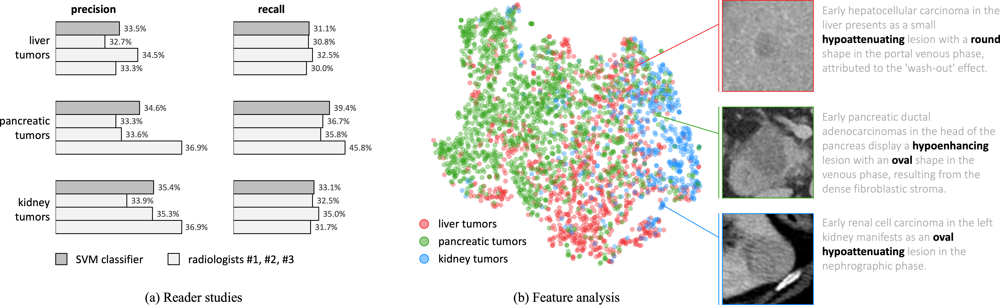

# Generalizable Tumor Synthesis

This repository provides extensive examples of synthetic liver tumors generated by our novel strategies. Check to see if you could tell which is real tumor and which is synthetic tumor. More importantly, our synthetic tumors can be used for training AI models, and have proven to achieve a similar (actually, *better*) performance in real tumor segmentation than a model trained on real tumors. 

**Amazing**, right? 

<p align="center"></p>


## Paper

<b>Towards Generalizable Tumor Synthesis</b> <br/>
[Qi Chen](https://scholar.google.com/citations?user=4Q5gs2MAAAAJ&hl=en)<sup>1,2</sup>, [Xiaoxi Chen](https://www.linkedin.com/in/xiaoxichensjtu/?originalSubdomain=cn)<sup>3</sup>, [Alan L. Yuille](https://www.cs.jhu.edu/~ayuille/)<sup>1</sup>, [Zhiwei Xiong](http://staff.ustc.edu.cn/~zwxiong/)<sup>2</sup>, [Wei Chen](https://weichen582.github.io/)<sup>1</sup> and [Zongwei Zhou](https://www.zongweiz.com/)<sup>1,*</sup> <br/>
<sup>1 </sup>Johns Hopkins University,  <br/>
<sup>2 </sup>University of Science and Technology of China,  <br/>
<sup>3 </sup>Shanghai Jiao Tong University  <br/>
CVPR, 2024 <br/>
[paper](https://www.cs.jhu.edu/~alanlab/Pubs24/chen2024towards.pdf 
) | [code](https://github.com/MrGiovanni/DiffTumor)

**We have documented common questions for the paper in [Frequently Asked Questions (FAQ)](documents/FAQ.md).**

**We have summarized publications related to tumor synthesis in [Awesome Synthetic Tumors](https://github.com/MrGiovanni/SyntheticTumors/blob/main/AWESOME.md) [](https://awesome.re).**

## Visual Turing Test
<p align="center"></p>

## Model

| Tumor | Model | Download |
| ----  | ----  | ----     |
| liver  | U-Net  | [link]() |
| pancreas  | U-Net | [link]() |
| kidney  | U-Net | [link]() |
| liver  | nnU-Net | [link]() |
| pancreas  | nnU-Net | [link]() |
| kidney  | nnU-Net | [link]() |
| liver  | Swin-UNETR | [link]() |
| pancreas  | Swin-UNETR | [link]() |
| kidney  | Swin-UNETR | [link]() |

**Use the following command to download everything.**
```bash
wget https://www.dropbox.com/xxx
tar -xzvf checkpoint.tar.gz
```
   
## 0. Installation

```bash
git clone https://github.com/MrGiovanni/DiffTumor.git
cd DiffTumor
```

See [installation instructions](https://github.com/MrGiovanni/DiffTumor/blob/main/INSTALL.md).

## 1. Train Autoencoder Model
```
cd AutoencoderModel
gpu_num=1
datapath=/mnt/ccvl15/chongyu/
cache_rate=0.05
batch_size=4
python train.py dataset.data_root_path=$datapath dataset.cache_rate=$cache_rate dataset.batch_size=$batch_size model.gpus=$gpu_num
```

## 2. Train Diffusion Model
```
cd DiffusionModel
python train.py dataset.name=liver_tumor_train dataset.fold=0 dataset.dataset_list=['liver_tumor_data_early_fold'] dataset.uniform_sample=False model.results_folder_postfix="fold0_tumor_96_t4"  
```

## 3. Train Segmentation Model
```
cd SegmentationModel

healthy_datapath=/data/jliang12/zzhou82/datasets/PublicAbdominalData/
datapath=/data/jliang12/zzhou82/datasets/PublicAbdominalData/
cache_rate=1.0
batch_size=12
val_every=50
workers=12
organ=liver
fold=0

# U-Net
backbone=unet
logdir="runs/$organ.fold$fold.$backbone"
datafold_dir="cross_eval/'$organ'_aug_data_fold/"
dist=$((RANDOM % 99999 + 10000))
python -W ignore main.py --model_name $backbone --cache_rate $cache_rate --dist-url=tcp://127.0.0.1:$dist --workers $workers --max_epochs 2000 --val_every $val_every --batch_size=$batch_size --save_checkpoint --distributed --noamp --organ_type $organ --organ_model $organ --tumor_type tumor --fold $fold --ddim_ts 50 --logdir=$logdir --healthy_data_root $healthy_datapath --data_root $datapath --datafold_dir $datafold_dir

# nnU-Net
backbone=nnunet
logdir="runs/$organ.fold$fold.$backbone"
datafold_dir="cross_eval/'$organ'_aug_data_fold/"
dist=$((RANDOM % 99999 + 10000))
python -W ignore main.py --model_name $backbone --cache_rate $cache_rate --dist-url=tcp://127.0.0.1:$dist --workers $workers --max_epochs 2000 --val_every $val_every --batch_size=$batch_size --save_checkpoint --distributed --noamp --organ_type $organ --organ_model $organ --tumor_type tumor --fold $fold --ddim_ts 50 --logdir=$logdir --healthy_data_root $healthy_datapath --data_root $datapath --datafold_dir $datafold_dir

# Swin-UNETR
backbone=swinunetr
logdir="runs/$organ.fold$fold.$backbone"
datafold_dir="cross_eval/'$organ'_aug_data_fold/"
dist=$((RANDOM % 99999 + 10000))
python -W ignore main.py --model_name $backbone --cache_rate $cache_rate --dist-url=tcp://127.0.0.1:$dist --workers $workers --max_epochs 2000 --val_every $val_every --batch_size=$batch_size --save_checkpoint --distributed --noamp --organ_type $organ --organ_model $organ --tumor_type tumor --fold $fold --ddim_ts 50 --logdir=$logdir --healthy_data_root $healthy_datapath --data_root $datapath --datafold_dir $datafold_dir

```

## 2. Evaluation

```
cd SegmentationModel
datapath=/mnt/ccvl15/zzhou82/PublicAbdominalData/
organ=liver
fold=0
datafold_dir="cross_eval/'$organ'_aug_data_fold/"

# U-Net
python -W ignore validation.py --model=unet --data_root $datapath --datafold_dir $datafold_dir --tumor_type tumor --organ_type $organ --fold $fold --log_dir $organ/$organ.fold$fold.unet --save_dir out/$organ/$organ.fold$fold.unet

# nnU-Net
python -W ignore validation.py --model=nnunet --data_root $datapath --datafold_dir $datafold_dir --tumor_type tumor --organ_type $organ --fold $fold --log_dir $organ/$organ.fold$fold.unet --save_dir out/$organ/$organ.fold$fold.unet

# Swin-UNETR
python -W ignore validation.py --model=swinunet --data_root $datapath --datafold_dir $datafold_dir --tumor_type tumor --organ_type $organ --fold $fold --log_dir $organ/$organ.fold$fold.unet --save_dir out/$organ/$organ.fold$fold.unet

```

## TODO

- [x] Upload the paper to arxiv
- [x] Upload the videos about Visual Turing Test
- [ ] Release the diffusion checkpoint
- [ ] Release the segmentation checkpoint

## Citation

```
@misc{chen2024generalizable,
      title={Towards Generalizable Tumor Synthesis}, 
      author={Qi Chen and Xiaoxi Chen and Haorui Song and Zhiwei Xiong and Alan Yuille and Chen Wei and Zongwei Zhou},
      year={2024},
      eprint={2402.19470},
      archivePrefix={arXiv},
      primaryClass={eess.IV}
}
```

## Acknowledgement

This work was supported by the Lustgarten Foundation for Pancreatic Cancer Research and the McGovern Foundation. The segmentation backbone is based on [Swin UNETR](https://github.com/Project-MONAI/tutorials/blob/main/3d_segmentation/swin_unetr_btcv_segmentation_3d.ipynb); we appreciate the effort of the [MONAI Team](https://monai.io/) to provide and maintain open-source code to the community. We thank Camille Torrico and Alexa Delaney for improving the writing of this paper. Paper content is covered by patents pending.
